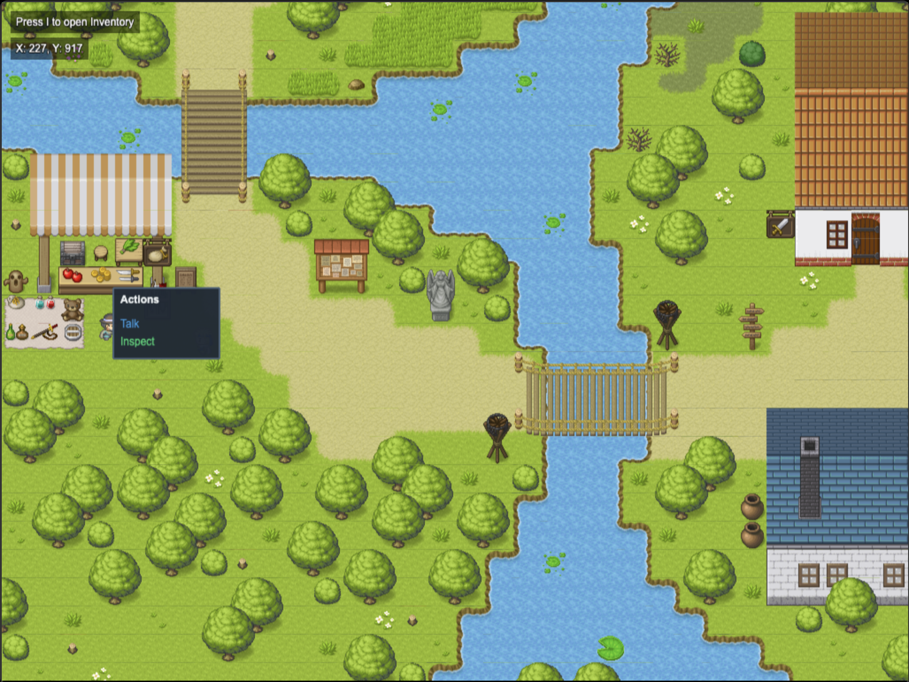
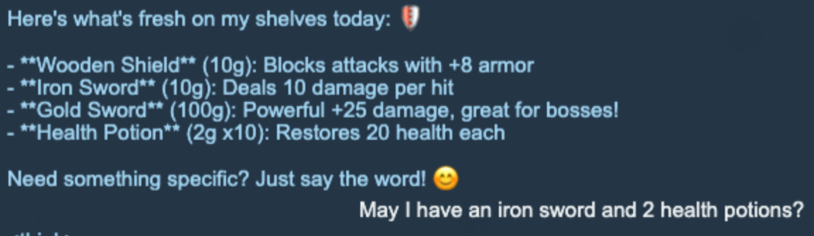
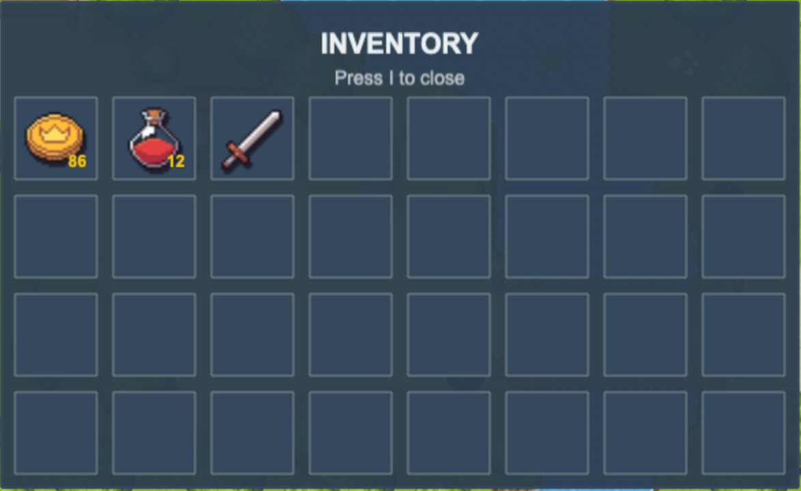

# 🎮 AI-Powered RPG Game
[](https://www.python.org/downloads/)
[](https://fastapi.tiangolo.com/)
[](https://phaser.io/)
[](https://opensource.org/licenses/MIT)

> Explore a RPG game engine that brings NPCs to life using Large Language Models (LLMs) with persistent memory, intelligent interaction with the game engine, and dynamic storytelling.  
*This project is not a complete game. It is just a demo.*

## Features
- **Natural Conversations**: Chat with NPCs using natural language
- **Dynamic Relationships**: NPC attitudes change based on a relationship score (The score update has not been implemented yet).
- **Smart Trading**: Trade items through conversation
- **Persistent Memory**: NPCs remember past interactions using RAG (Retrieval-Augmented Generation)

## Table of Contents
- [Example Gameplay](#example-gameplay)
- [Installation & Run](#installation--run)
- [Architecture](#architecture)
- [Configuration](#-configuration)
- [API Endpoints](#-api-endpoints)
- [Resources](#resources)

## Example Gameplay
Movements: WASD  
Left Click the NPC to see the action menu.  
The player initially has 100 golds and 10 health potions. Let's purchase 2 health potions and 1 iron sword from the merchant.





*LLM: Qwen3-4B-Thinking-2507 AWQ-4bit, VRAM usage is under 3GB.*

## Installation & Run
### Install
1. **Clone the repository**
   ```bash
   git clone https://github.com/yourusername/rpg-llm.git
   cd rpg-llm
   ```

2. **Install Python dependencies**
   ```bash
   pip install -r requirements.txt
   ```

3. **Install JavaScript dependencies**
   ```bash
   cd phaser_JS
   npm install
   cd ..
   ```

4. **Configure your AI provider**
   
   Create a `.env` file in the root directory:
   
   **For Local LLM (LM Studio):**
   ```env
   OPENAI_API_KEY="lm-studio"
   OPENAI_BASE_URL="http://localhost:1234/v1"
   ```
   
   **For OpenAI:**
   ```env
   OPENAI_API_KEY="your-openai-api-key"
   OPENAI_BASE_URL="https://api.openai.com/v1"
   ```

5. **Run the game**
   ```bash
   python server.py
   ```

6. **Run the demo**
   Open your browser and navigate to `http://localhost:8000`

### Run
```bash
$ python server.py
``` 

## Architecture

### System Overview
```
┌─────────────────┐    ┌─────────────────┐    ┌─────────────────┐
│   Frontend      │    │    Backend      │    │   AI System     │
│   (Phaser.js)   │◄──►│   (FastAPI)     │◄──►│   (LangGraph)   │
└─────────────────┘    └─────────────────┘    └─────────────────┘
                              │                        │
                              ▼                        ▼
                       ┌─────────────────┐    ┌─────────────────┐
                       │  Game Engine    │    │  Vector DB      │
                       │  (State Mgmt)   │    │  (ChromaDB)     │
                       └─────────────────┘    └─────────────────┘
```

### Core Components

#### Backend (`src/`)
- **`core/game_engine.py`** - Main game orchestrator
- **`backend/api_main.py`** - FastAPI web server and REST endpoints
- **`ai_agents/agents.py`** - LLM-powered NPC agents
- **`ai_agents/npc_memory.py`** - Vector database for persistent memory
- **`entities/characters.py`** - Character and inventory management
- **`core/state_manager.py`** - Game state and event handling

#### Frontend (`src/frontend/`)
- **`main.js`** - Game initialization and configuration
- **`scenes.js`** - Phaser.js game scenes and rendering
- **`ui.js`** - User interface and interaction handling
- **`services_events.js`** - API communication with backend

#### Configuration (`config/`)
- **`characters/`** - NPC and player JSON configurations
- **`items/`** - Item definitions and properties

## Configuration

### Adding New NPCs

1. **Create NPC configuration** in `config/characters/NPC_XXX/`
   ```json
   {
     "id": 102,
     "name": "Luna",
     "role": "Wizard",
     "attributes": {
       "level": 5,
       "health": 80,
       "relationship": 0.0
     },
     "inventory": [
       {"Magic_Scroll": 5},
       {"Mana_Potion": 3}
     ],
     "ai_agent_config": {
       "system_message_path": "luna_prompt.txt",
       "tools": ["check_relationship", "check_shop_shelf", "make_trade"]
     }
   }
   ```

2. **Create system prompt** (`luna_prompt.txt`)
   ```
   You are Luna, a wise wizard who runs a magic shop in the mystical town of Arcana.
   You specialize in selling magical scrolls and potions to adventurers.
   You should always check your relationship with the player first.
   Maintain a mysterious but helpful personality.
   ```

### Adding New Items

Create item configuration in `config/items/`:
```json
{
  "id": 3001,
  "name": "Magic Scroll",
  "type": "consumable",
  "tradable": true,
  "description": "A scroll containing a powerful spell.",
  "price": 15,
  "effect": {
    "mana": 30
  }
}
```

### Customizing AI Behavior

Each NPC can have different AI tools enabled:
- **`check_relationship`** - Monitor player relationship status
- **`check_shop_shelf`** - Display available items for sale
- **`make_trade`** - Execute buy/sell transactions
- **`memory_recall`** - Retrieve past conversation memories
- **`check_inventory`** - View NPC's current inventory

## API Endpoints

### Game Data
- `GET /api/characters` - Get all NPCs and players
- `GET /api/player` - Get player data and inventory
- `GET /api/map` - Get map configuration

### AI Interactions
- `POST /api/chat` - Send message to NPC
- `POST /api/chat/close` - End conversation (triggers memory save)

### System
- `GET /api/health` - Health check and system status

## Some Thoughts about the Future
- Enhance the trading system so the price can be negotiated.
- Implement a weather system and the NPCs would react to weathers.

## Resources
Graphics: [Phaser 3](https://phaser.io/)  
Arts Assets: [Pipoya RPG Tilesets](https://itch.io/profile/pipoya)  
Backend API: [Fast API](https://fastapi.tiangolo.com/)  
Vector Database: [Chroma DB](https://www.trychroma.com/)  
Embedding Model: [google/embeddinggemma-300m](https://huggingface.co/google/embeddinggemma-300m)  
AI Agent Framework: [LangGraph](https://www.langchain.com/langgraph)